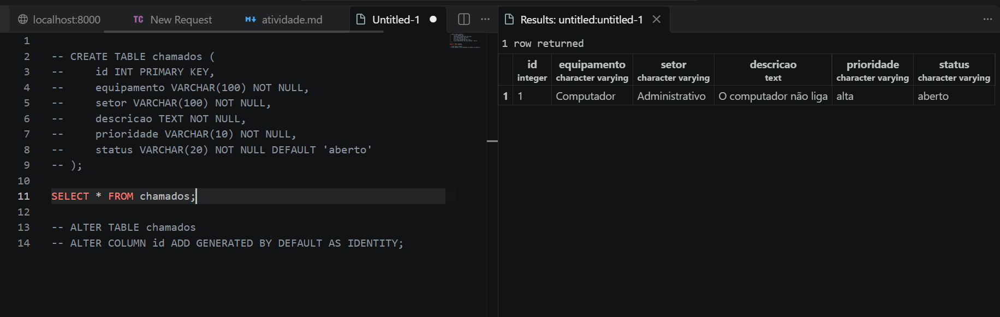
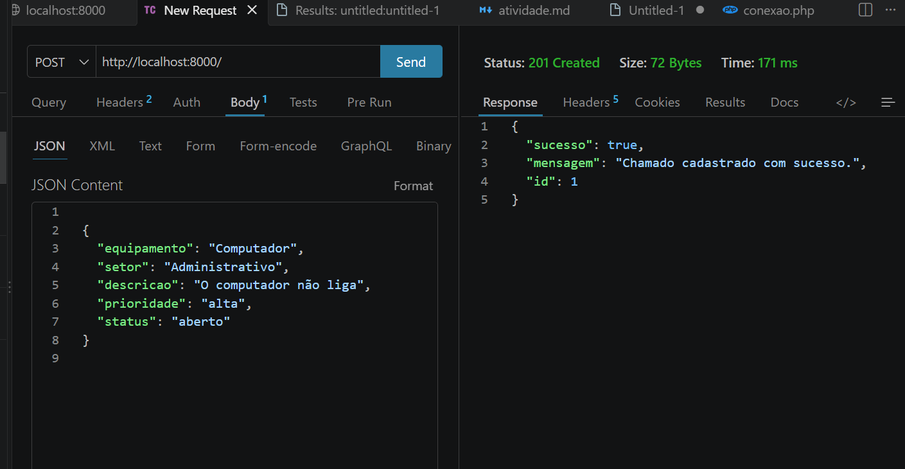
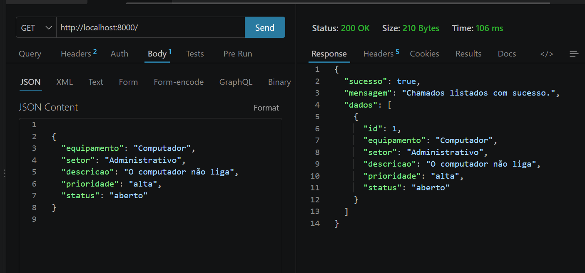
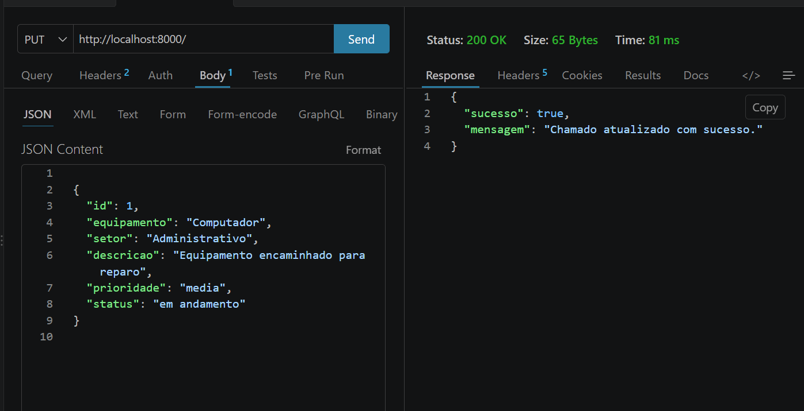
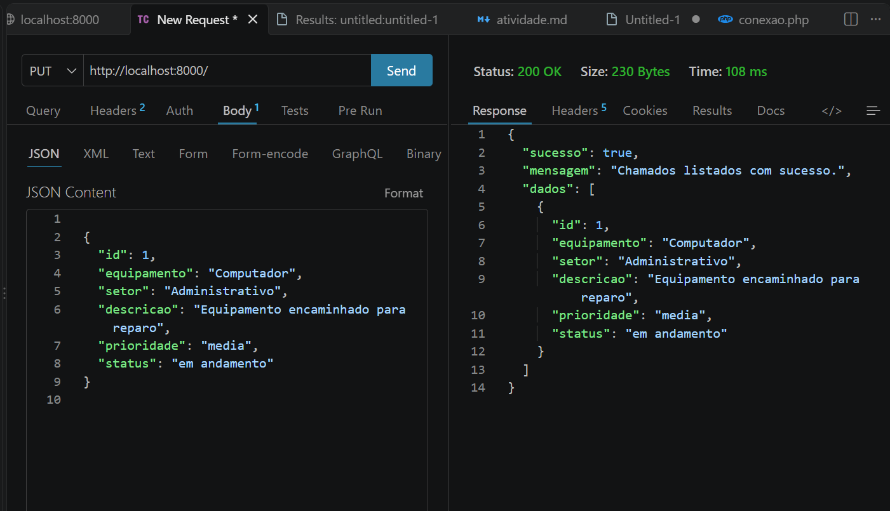
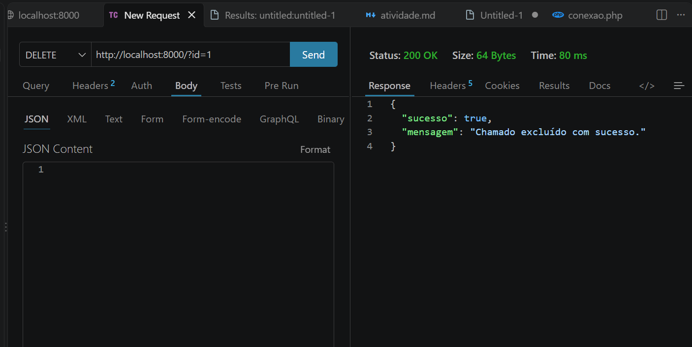
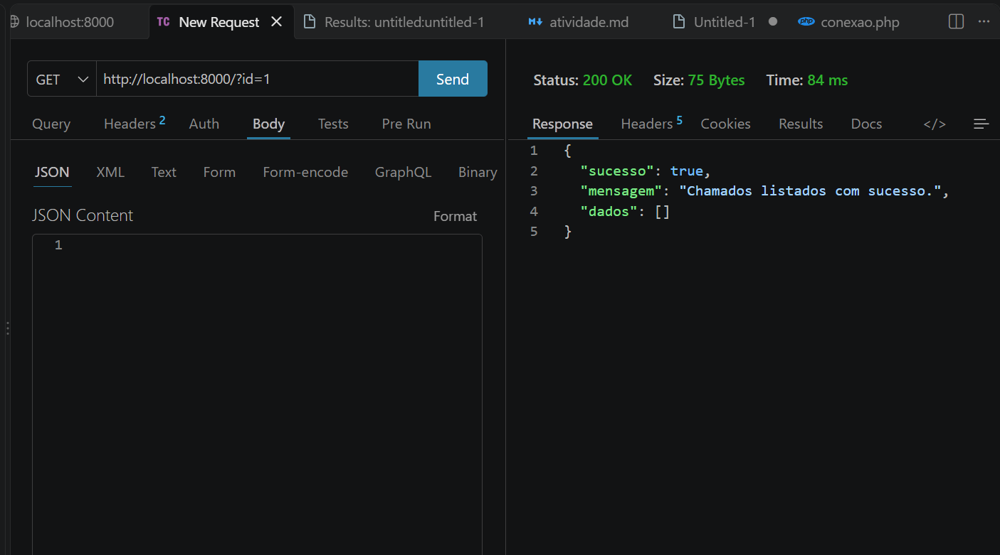
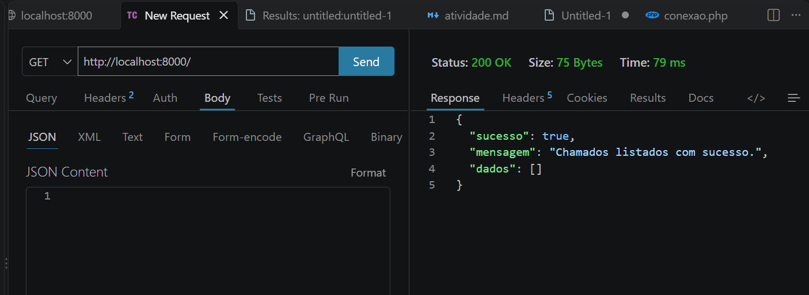

## 📝 Atividade 08 - Criação de API REST (GET,POST,PUT,DELETE) com SQL 

Projeto – API para Controle de Chamados de Manutenção
Uma empresa precisa melhorar o controle dos chamados de manutenção de seus equipamentos. Atualmente, os problemas são informados por mensagens ou anotações em papel, dificultando o acompanhamento dos serviços e a identificação dos chamados mais urgentes.

Você foi contratado para desenvolver uma API em PHP que permita registrar e gerenciar esses chamados. Para isso, crie um banco de dados chamado manutencao e uma tabela chamada chamados. A tabela deverá possuir os campos id, equipamento, setor, descricao, prioridade e status. O campo id deverá ser a chave primária e possuir incremento automático.

A API deverá utilizar PDO, receber e devolver os dados no formato JSON e implementar as quatro operações básicas de um CRUD. O método POST deverá cadastrar um novo chamado, o método GET deverá listar todos os chamados cadastrados, o método PUT deverá atualizar um chamado utilizando seu id e o método DELETE deverá excluir um chamado.

A prioridade deverá aceitar os valores baixa, media ou alta, enquanto o status deverá aceitar aberto, em andamento ou concluido. Antes de executar uma operação, o sistema deverá verificar se os dados obrigatórios foram informados. Quando uma operação for concluída, a API deverá retornar uma mensagem em JSON informando seu resultado.

